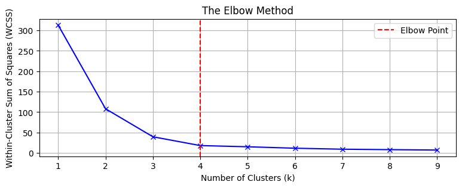

--- 
layout: post
title: In K-Means, do we manually choose the value of k or does the algorithm determine it? How can we validate that the chosen k is appropriate?
gh-repo: Ad7amstein/Interview-Questions
gh-user: Ad7amstein
gh-badge: [star, fork, follow]
tags: [ml, unsupervised, clustering, kmeans]
comments: true
mathjax: true
author: Adham Allam
profile-link: https://www.linkedin.com/in/adham-allam/
--- 

**K-Means clustering and the choice of _k_**  

## Do we manually choose _k_?  

Yes, in **standard K-Means**, the value of _k_ (number of clusters) is not automatically determined by the algorithm. The user must specify it beforehand. The algorithm then partitions the data into exactly _k_ clusters.  

## How can we validate that the chosen _k_ is appropriate?  

Several methods can be used to assess and justify the choice of _k_:  

- **Elbow Method**  
  Plot the _Within-Cluster Sum of Squares (WCSS)_ against different values of _k_. Look for the “elbow point” where adding more clusters no longer significantly reduces WCSS.  

- **Silhouette Score**  
  Measures how similar a point is to its own cluster compared to other clusters. Ranges from -1 to 1. Higher values mean better-defined clusters.  

- **Gap Statistic**  
  Compares the WCSS of the given clustering to that of a random uniform distribution. A higher gap indicates a better choice of _k_.  

- **Cross-validation with clustering stability**  
  Test the robustness of clusters by running K-Means multiple times with different initializations or subsets of data. If the clustering is stable, the chosen _k_ is likely appropriate.  

- **Domain Knowledge**  
  Sometimes the correct number of clusters is determined by the problem context (e.g., known categories in business or biology).  

## Example Table: Methods to validate _k_  

| Method              | Description                                   | When to Use |
|---------------------|-----------------------------------------------|-------------|
| Elbow Method        | Find elbow in WCSS vs. k plot                 | Quick, intuitive |
| Silhouette Score    | Measures cluster separation                   | Works for most datasets |
| Gap Statistic       | Compares clustering to random distribution    | More rigorous |
| Stability Analysis  | Tests clustering consistency                  | Large datasets |
| Domain Knowledge    | Uses real-world context                       | Applied problems |

### Notification  

{: .box-note}  
**Note:** There is no single "perfect" value of _k_. Often, multiple validation methods are combined to make a more reliable choice.  

### Warning  

{: .box-warning}  
**Warning:** Picking a very high _k_ can lead to overfitting (clusters become too small and meaningless).  
