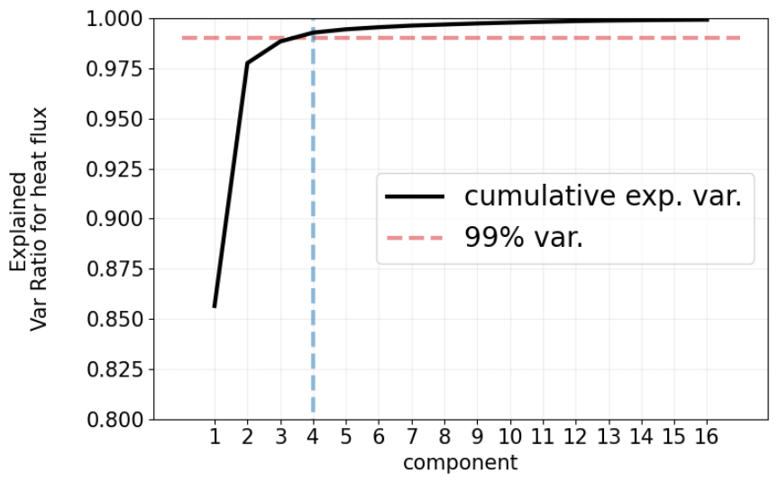

 
{: .box-success}  
Yes, besides simply selecting the number of components by explained variance, you can use methods like the scree plot, Kaiser criterion, cross-validation with downstream tasks, reconstruction error, or even domain knowledge to decide how many features to keep.  

PCA (Principal Component Analysis) is often used to reduce dimensionality, but deciding **how many features (principal components) to keep** can be tricky. While variance explained is the most common criterion, there are **alternative methods** to guide the choice.  

## Alternative Ways to Choose Number of Features in PCA  

### 1. **Cumulative Explained Variance Ratio (i.e., Scree plots)**  

- Keep enough components to explain a certain threshold of total variance (e.g., 90–95%).  
- Plot the **explained variance ratio curve** and choose the "elbow point."  

### 3. **Cross-Validation for Downstream Tasks**  

- Instead of only looking at variance, test PCA-reduced features on your ML model.  
- Use cross-validation to check model accuracy across different numbers of components.  

### 4. **Domain Knowledge**  

- Keep components that correspond to meaningful patterns in the data.  
- For example, in image data, first few components often capture lighting and shape information.  

### 5. **Information Criteria (AIC, BIC)**  

- Statistical model selection tools (AIC/BIC) can help determine the optimal number of features for balancing complexity and fit.  

### 6. **Reconstruction Error**  

- Measure how well original data can be reconstructed from the reduced components.  
- Keep enough components until reconstruction error is acceptably low.  

---

## Example: Cumulative Variance  

Suppose we have 50 features. After PCA:  

- First 10 components explain **88% variance**.  
- First 15 components explain **95% variance**.  

Depending on the tolerance for information loss, we might keep **10 or 15 features**.  

---

## Conclusion  

{: .box-note}  
**Note:** While PCA itself is unsupervised, choosing the number of components can depend on your **end goal**:  

- If the goal is **compression/visualization** → variance explained may be enough.  
- If the goal is **prediction** → validate using model performance.  
